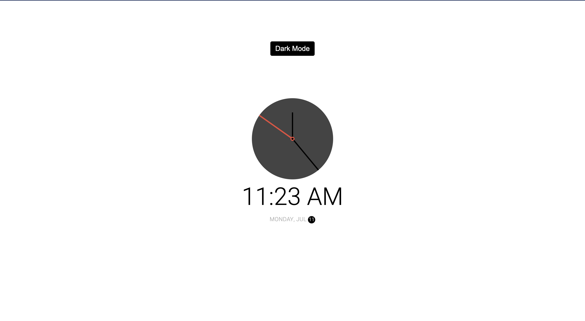
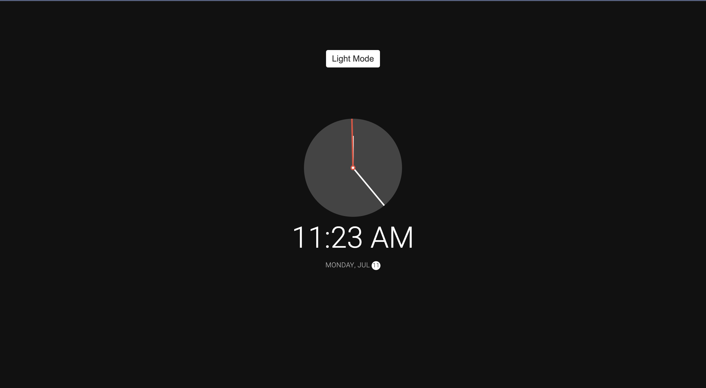

# 50 Projects in 50 Days - Theme Clock

This is a code along project in the [50 Projects In 50 Days - HTML, CSS & JavaScript Udemy Course](https://www.udemy.com/course/50-projects-50-days/). Sharpen your skills by building 50 quick, unique & fun mini projects.

## Table of contents 😌

- [Overview](#overview)
  - [The project](#the-project)
  - [Screenshot](#screenshot)
  - [Links](#links)
- [My process](#my-process)
  - [Built with](#built-with)
  - [What I learned](#what-i-learned)
  - [Continued development](#continued-development)
  - [Code snippets](#im-really-proud-of-these-code-snippets%EF%B8%8F)
  - [Useful resources](#useful-resources)
- [Author](#author)
- [Acknowledgments](#acknowledgments)

## Overview👋🏾

Welcome to the 19<sup>th</sup> mini-project of the course!

### The project😥

In this project users will be able to:

- Build a responsive site that displays a functional theme clock.

### Screenshot🌇




### Links👩🏾‍💻

- Live Site URL: (https://clever-jalebi-7f2217.netlify.app/)

## My process💭

This is a simple project that I started by marking out initial structure, classes, and id's in HTML. Next I finalized the UI by styling the CSS. I styled both the light and dark modes, the clock hands, and the digital output as well as the date section. I then added functionality by way of JavaScript to switch between light and dark modes when the user clicks on the button. I also made the clock hands functional by utilizing the Date() constructor, and mapped the range of hours minutes and seconds to 360 degrees in order to make the analog clock functional.

### Built with👷🏾‍♀️

- Semantic HTML5 markup
- CSS custom properties
- Flexbox
- JavaScript

### What I learned👩🏾‍🏫

I learned the Date() constructor has parameters that can be called upon to access specific date/time information.

I also learned how to map a range of numbers to another range of numbers.

### Continued development🔮

In the future I plan on continuing to practice positioning elements using flexbox, and using different selectors such as nth of type to select elements.

I also plan on continuing to practice using event listeners to make my pages more functional.

I also plan on continuing to learn the best ways to phrase git commits, so that future viewers can fully understand the changes that have occurred.

### I'm really proud of these code snippets✂️

```js
function setTime() {
  const time = new Date();
  const month = time.getMonth();
  const day = time.getDay();
  const date = time.getDate();
  // 24 hour clock setting
  const hours = time.getHours();
  // 12 hour clock setting
  const hoursForClock = hours % 12;
  const minutes = time.getMinutes();
  const seconds = time.getSeconds();
  const ampm = hours >= 12 ? 'PM' : 'AM';

  hourEl.style.transform = `translate(-50%, -100%) rotate(${scale(
    hoursForClock,
    0,
    11,
    0,
    360
  )}deg)`;
  minuteEl.style.transform = `translate(-50%, -100%) rotate(${scale(
    minutes,
    0,
    59,
    0,
    360
  )}deg)`;
  secondEl.style.transform = `translate(-50%, -100%) rotate(${scale(
    seconds,
    0,
    59,
    0,
    360
  )}deg)`;

  timeEl.innerHTML = `${hoursForClock}:${
    minutes < 10 ? `0${minutes}` : minutes
  } ${ampm}`;

  dateEl.innerHTML = `${days[day]}, ${months[month]} <span class= "circle">${date}</span>`;
}
```

### Useful resources📖

- [Resource 1](https://developer.mozilla.org/en-US/docs/Web/JavaScript/Reference/Global_Objects/Date/Date) - This is an amazing article which helped me understand the Date() constructor as well as how to fully access the information container within. I'd recommend it to anyone still learning this concept.
- [Resource 2](https://stackoverflow.com/questions/10756313/javascript-jquery-map-a-range-of-numbers-to-another-range-of-numbers) - This is an link that details how to map a range of numbers to another range of numbers.

## Author🔎

- Website - [Portfolio Site](https://maiannethornton.netlify.app/)
- Frontend Mentor - [@MaianneThornton](https://www.frontendmentor.io/profile/MaianneThornton)
- GitHub - [@MaianneThornton](GitHub.com/MaianneThornton)
- Twitter - [@MaianneThornton](https://twitter.com/MaianneThornton)
- LinkedIn - [@MaianneThornton](https://www.linkedin.com/in/maiannethornton/)

## Acknowledgments🙏🏾

Special Thanks go to [Brad Traversy](http://www.traversymedia.com/) and [Florin Pop](http://www.florin-pop.com/) creating the course and making reviewing concepts fun 😊.
